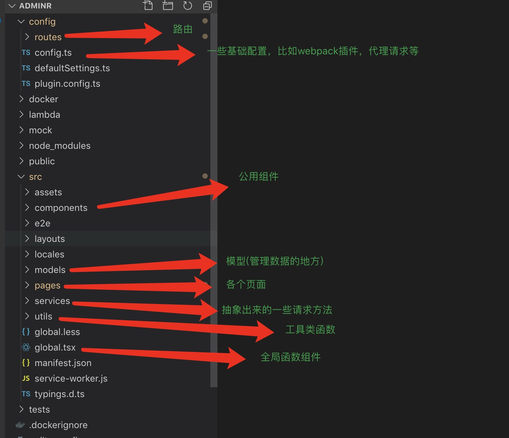
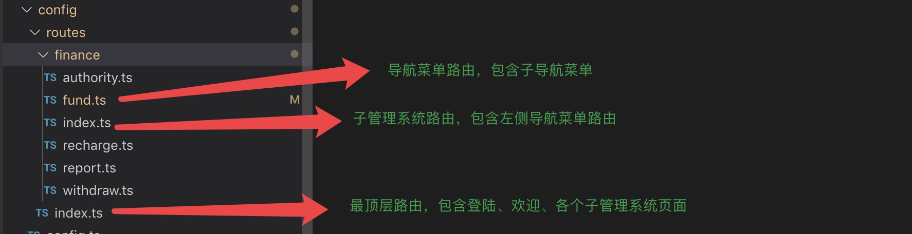
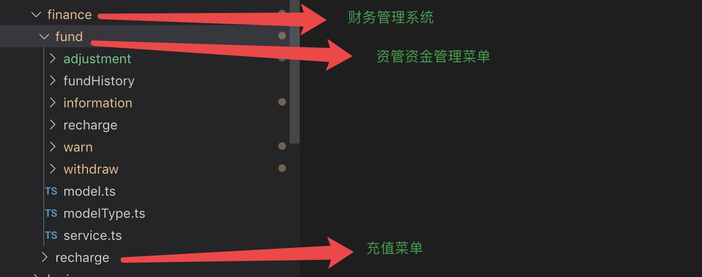
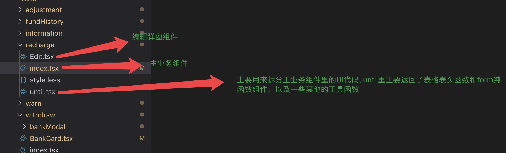

## 目录结构

---

- ## 部分文件说明

1. ### 路由 / routes
2. ### 页面 / pages
3. ### 模型 / models



---

- ## 路由



### routes/index.ts 代码：

```javascript
import FinaceRoutes from './finance';
let AllRoutes: Array<any>;

AllRoutes = [
  //登陆页面
  {
    path: '/user/login',
    component: '../layouts/UserLayout.tsx',
    Routes: ['src/pages/Authorized'],
    authority: ['admin', 'user'],
    routes: [
      {
        path: '/user/login',
        name: 'welcome',
        icon: 'smile',
        // component: './user/login',
        component: './login',
      },
      {
        component: './404',
      },
    ],
  },

  //子系统导航页

  {
    path: '/',
    component: '../layouts/BlankLayout.tsx',
    Routes: ['src/pages/Authorized'],
    authority: ['admin', 'user'],
    exact: true,
    routes: [
      {
        path: '/',
        name: 'welcome',
        icon: 'smile',
        component: './Welcome',
        exact: true,
      },
      {
        component: './404',
      },
    ],
  },

  {
    component: './404',
  },
];

export const getRoutes = (): any => {
  //FinaceRoutes - 财务管理系统路由
  AllRoutes = [FinaceRoutes, ...AllRoutes];
  return AllRoutes;
};
```

### routes/finance/index.tsx 代码：

```typescript
import withdrawRoutes from './withdraw';
import fundRoutes from './fund';
import reportRoutes from './report';
import authorityRoutes from './authority';
import rechargeRoutes from './recharge';
interface anyProps {
  [propName: string]: any;
}

let FinanceRoutes: anyProps;
//财务管理系统中的导航菜单路由

FinanceRoutes = {
  path: '/finance',
  component: '../layouts/BasicLayout.tsx',
  Routes: ['src/pages/Authorized'],
  authority: ['admin', 'user'],
  routes: [
    withdrawRoutes,
    rechargeRoutes,
    fundRoutes,
    reportRoutes,
    authorityRoutes,
    {
      component: './404',
    },
  ],
};
export default FinanceRoutes;
```

- ## models 管理数据

* ##### 按照 antpro 官方的推荐，我们并没有把 model 写到 models 文件夹下，而是写在了每个导航菜单所属的文件夹中
* ##### 每个导航菜单所在的根目录下都有一个 model.ts 和 service.ts

* #### fund/model.ts 删减后的代码：

```typescript
import { message } from 'antd';
import { ModelType } from '@/common-typings';

import {
  getRechargeData,
  editRechargeData,
} from './service';

const Model: ModelType = {
  namespace: 'fund',  //命名空间，这里我们以一级菜单为单位
  state: {
    rechargeData: {
      // 充值数据
      list: [],
    },
    thirdData: {
      // 提现-第三方数据
      list: [],
    },
  },

  effects: {
    // payload 请求参数
    //  effects里有三个参数
    //  call 用于调用异步逻辑 , put 用于派发action ,  select 用于从 state 里获取数据。
    // 资管-充值
    *rechargeDataEffect({ payload }, { call, put, select}) {
      const response = yield call(getRechargeData, payload);
      yield put({ type: 'setRechargeData', payload: response });
    },

    // 充值编辑
    *editRechargeDataEffect({ payload, fn }, { call, put }) {
      const response = yield call(editRechargeData, payload);
      message.success(response.msg);
      if (fn) {
        fn(response);
      }
    },
  }

  reducers: {
    // 充值数据
    setRechargeData(state, { payload }) {
      const newState = JSON.parse(JSON.stringify(state));
      newState.rechargeData.list = payload;
      return {
        ...state,
        ...newState,
      };
    },
  },
};

export default Model;
```

- #### fund/service.ts 代码：

```typescript
import request from '@/utils/request';
import { FormDataType } from '@/common-typings';

const RECHARGE_DATA_PATH = '/api/recharge/data';
const EDIT_RECHARGE_PATH = '/api/recharge/edit';

const selfRequest = (path: string, params: FormDataType) =>
  request(path, {
    method: 'POST',
    data: params,
  });

// 资管 - 充值资金管理
export async function getRechargeData(params: FormDataType) {
  return selfRequest(RECHARGE_DATA_PATH, params);
}
// 充值编辑
export async function editRechargeData(params: FormDataType) {
  return selfRequest(EDIT_RECHARGE_PATH, params);
}
```

#### models 工作流程

##### 1. dva 类似 react-dedux，给我们提供了一个 connect 高阶组件

##### 2. 在组件中用 connect 把组件和数据连接起来，并接收 model 中 state 的数据

##### 2. 在组件里面派发 effect 到模型中

##### 3. 模型就会执行当前 effect 函数通过参数 call 函数发送请求出去，并得到返回值

##### 4. 再通过参数 put 触发 reducer 并把返回值作为参数给到 reducer， reducer 组装好数据后，再把数据返回给 model 中的 state

##### 5. 因为组件和 model 通过 connect 连接起来了，model 中的数据发生变化，所以组件也重新执行了 render 函数更新了视图。

- ## pages 文件夹结构目录



- #### 下面以 recharge 充值组件为例；
- #### recharge 文件下面



- #### rechare/index.tsx 代码

```jsx
import React, { ReactNode } from 'react';
import { Form, Input, Button, Table, Spin } from 'antd';
import { ColumnProps } from 'antd/lib/table';
import { connect } from 'dva';
// eslint-disable-next-line import/no-extraneous-dependencies
import { withRouter } from 'react-router-dom';
import Edit from './Edit';
import styles from './style.less';
import { getColumns, RechargeForm } from './until';
import { StateType } from '@/common-typings';

const selectClass = (record: any) => {
  if (record.red) {
    return record.red;
  }
  if (record.orange) {
    return record.orange;
  }
  return null;
};

class Recharge extends React.Component<StateType> {
  constructor(props: any) {
    super(props);
    this.handleSubmit = this.handleSubmit.bind(this);
    this.resetForm = this.resetForm.bind(this);
    this.okSaveEdit = this.okSaveEdit.bind(this);
    this.onShowSizeChange = this.onShowSizeChange.bind(this);
    this.bindEffects();
  }

  public state = {
    total: 200,
    pageSize: 10,
    current: 1,
    merchantName: null,
    merchantNumber: null,
    id: 0,
    showEditModal: false,
  };

  // 选择一页多少条
  public onShowSizeChange(current: number, pageSize: number) {
    this.setState({ pageSize }, () => {
      this.bindEffects();
    });
  }

  // 点击分页
  public handleChange = (page: number) => {
    this.setState({ current: page }, () => {
      this.bindEffects();
    });
  };

  // 重置查询条件
  public resetForm() {
    this.props.form.resetFields();
    if (!this.state.merchantName && !this.state.merchantNumber) {
      return;
    }
    this.setState({ merchantName: null, merchantNumber: null }, () => {
      this.bindEffects();
    });
  }

  // 确认编辑
  public okSaveEdit(params: any, cb) {
    const { dispatch } = this.props;
    const { id } = this.state;
    dispatch({
      type: 'fund/editRechargeDataEffect',
      payload: { ...params, id },
      fn: res => {
        console.log(res);
        this.setState({ showEditModal: false });
        if (cb) {
          cb();
        }
      },
    });
  }

  // 查询充值资金管理 ， SyntheticEvent 是处理表带的事件对象类型;
  public handleSubmit(e: React.SyntheticEvent) {
    e.preventDefault();
    this.props.form.validateFieldsAndScroll((err: any, values: any) => {
      if (!err) {
        this.setState(values, () => {
          this.bindEffects();
        });
        console.log(values);
      }
    });
  }

  private bindEffects() {
    const { pageSize, current, merchantName, merchantNumber } = this.state;
    this.props.dispatch({
      type: 'fund/rechargeDataEffect',
      payload: {
        current,
        pageSize,
        params: 'daniel',
        merchantName,
        merchantNumber,
      },
    });
  }

  public render(): ReactNode {
    const { getFieldDecorator, getFieldError, isFieldTouched } = this.props.form;
    const { total, current, pageSize, showEditModal } = this.state;
    const { rechargeData } = this.props.fund;
    const { loading, loadingEdit } = this.props;
    return (
      <div className={styles.rechargeWrap}>
        <Spin spinning={loading}>

          <RechargeForm
            handleSubmit={this.handleSubmit}
            getFieldDecorator={getFieldDecorator}
            resetForm={this.resetForm}
          />

          <div className={styles.balanceWrap}>
            <span>  可用资金总额：<i>100000000.00</i> </span>
            <span> 待结算总额： <i>199999.00</i>  </span>
            <Button>刷新</Button>
          </div>

          <Table<StateType>
            columns={getColumns(this)}
            dataSource={rechargeData.list}
            rowClassName={(record: any) => selectClass(record)}
            rowKey={(record: any) => record.id}
            pagination={{
              total,
              pageSize,
              current,
              onChange: this.handleChange,
              onShowSizeChange: this.onShowSizeChange,
              showSizeChanger: true,
              showQuickJumper: true,
              showTotal: () => `共 ${total}条记录 第 ${current} / ${Math.ceil(total / pageSize)}`,
            }}
          />

          <Edit<>
            show={showEditModal}
            showLoading={loadingEdit}
            hide={() => {
              this.setState({ showEditModal: false });
            }}
            handleOk={this.okSaveEdit}
          />
        </Spin>
      </div>
    );
  }
}

const WrappedRecharge = Form.create({ name: 'searchRecharge' })(Recharge);

export default withRouter(
  connect(({ fund, loading }: { fund: any; loading: any }) => ({
    fund,
    loading: loading.effects['fund/rechargeDataEffect'],
    loadingEdit: loading.effects['fund/editRechargeDataEffect'],
  }))(WrappedRecharge),
);


```

---

- #### recharge/until.tsx 代码 ：

---

```jsx
import React from 'react';
import { ColumnProps } from 'antd/lib/table';
import { Form, Input, Button } from 'antd';
import styles from './style.less';
import { StateType } from '@/common-typings';

export const getColumns = (self: any) => {
  const columns: ColumnProps<StateType>[] = [
    {
      title: '序号',
      dataIndex: 'order',
    },
    {
      title: '商户名称',
      dataIndex: 'merchantName',
    },
    {
      title: '  商户号',
      dataIndex: 'merchantNumber',
    },
    {
      title: '账户可用余额',
      dataIndex: 'banlance',
    },
    {
      title: '待结算金额',
      dataIndex: 'pendingSettlement',
    },
    {
      title: '渠道类型',
      dataIndex: 'channelType',
      filters: [
        { text: '渠道111', value: '1' },
        { text: '渠道222', value: '2' },
        { text: '渠道222', value: '3' },
      ],
    },
    {
      title: '日入款限额',
      dataIndex: 'dailyLimit',
    },
    {
      title: '今日入款剩余',
      dataIndex: 'remainingToday',
    },
    {
      title: '开关状态',
      dataIndex: 'switchStatus',
    },
    {
      title: '最后更新时间',
      dataIndex: 'lastUpdateTime',
    },
    {
      title: '操作',
      key: 'tags',
      render: (rowData: any) => (
        <div className={styles.tabelBtns}>
          <button type="button">明细</button>
          <button
            type="button"
            onClick={() => {
              self.setState({ showEditModal: true });
            }}
          >
            编辑
          </button>
          <button type="button">启用</button>
        </div>
      ),
    },
  ];
  return columns;
};

export const RechargeForm = (props: any) => {
  const { handleSubmit, getFieldDecorator, resetForm } = props;
  return (
    <Form layout="inline" onSubmit={handleSubmit} name="searchRecharge">
      <Form.Item label="商户名称">
        {getFieldDecorator('merchantName', {})(<Input allowClear placeholder="请输入商户名称" />)}
      </Form.Item>
      <Form.Item label="商户号">
        {getFieldDecorator('merchantNumber', {})(
          <Input allowClear type="userNumber" placeholder="请输入商户号" />,
        )}
      </Form.Item>
      <Form.Item className={styles.rechargeBtns}>
        <Button type="primary" htmlType="submit">
          查询
        </Button>
        <Button onClick={resetForm}>重置</Button>
      </Form.Item>
    </Form>
  );
};
```
